## 功能介绍 

本小程序是为博物馆打造的轻量化服务平台，旨在提升观众参观体验、优化博物馆运营效率，实现线上线下服务闭环。它既为观众提供便捷的信息获取、参观与活动预约、个人中心管理等功能，也为博物馆管理员提供高效的内容维护、预约管理、用户管理及数据导出等后台能力。对观众：信息获取更及时，参观体验更流畅，个人服务管理更便捷。
对博物馆：运营管理更高效，数据统计更精准，服务质量可量化。

 

## 技术运用
- 前端基于微信小程序平台进行开发
- 后端基于Java Springboot架构开发
- 数据库： MySQL (8.0+) 

## 演示 
 

## 安装

- 安装手册见源码包里的word文档 

## 截图
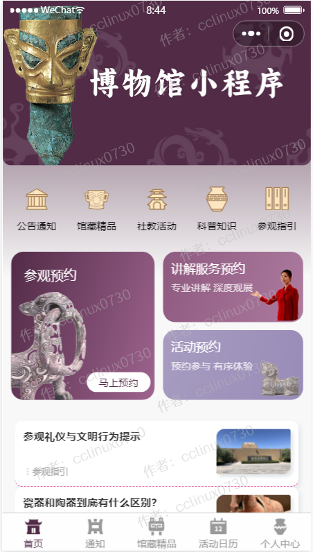

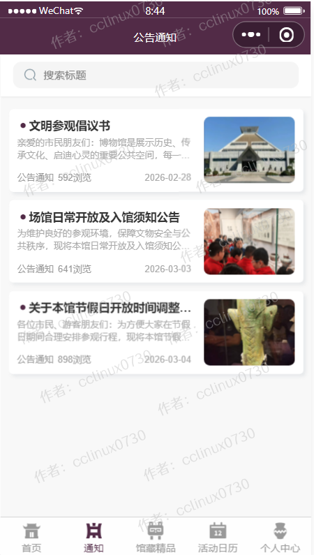

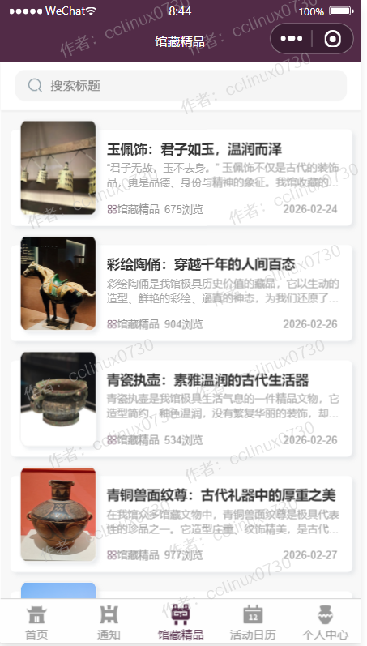
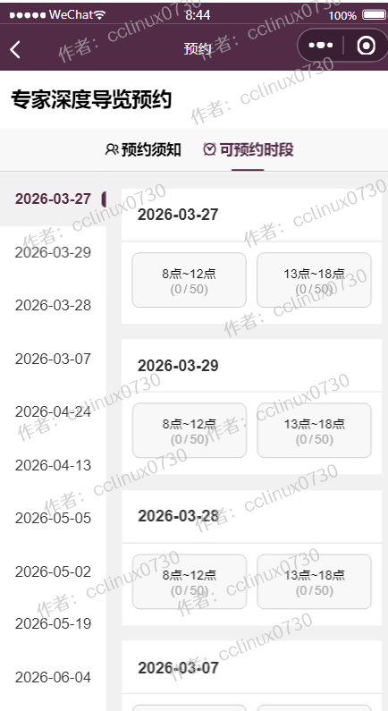

 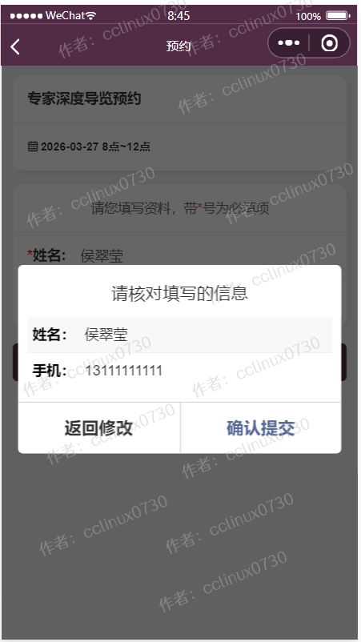
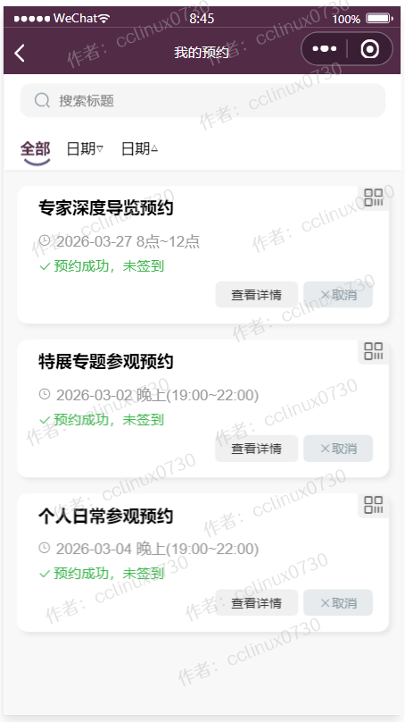
## 后台管理系统截图 
- 后台超级管理员默认账号:admin，密码123456，请登录后台后及时修改密码和创建普通管理员。

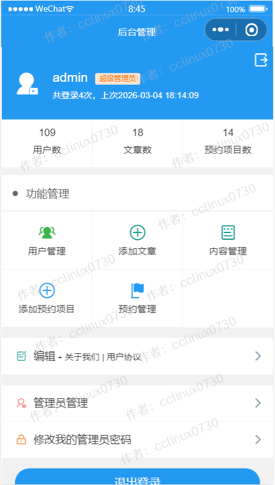
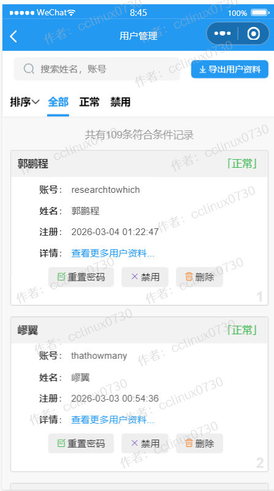

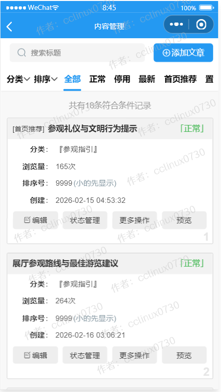

 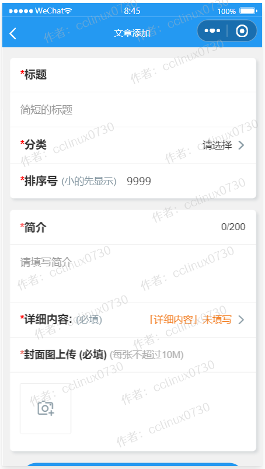

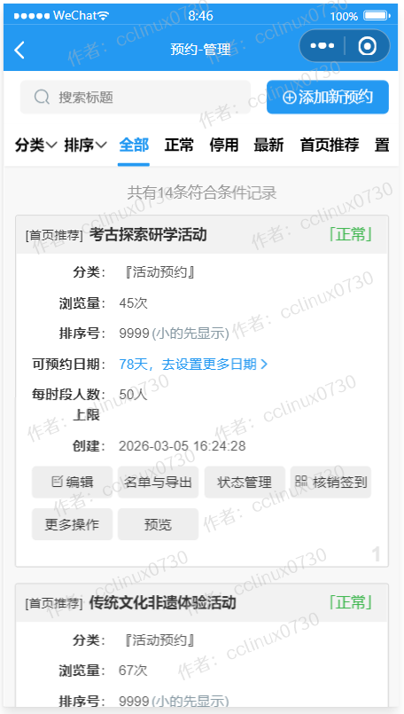

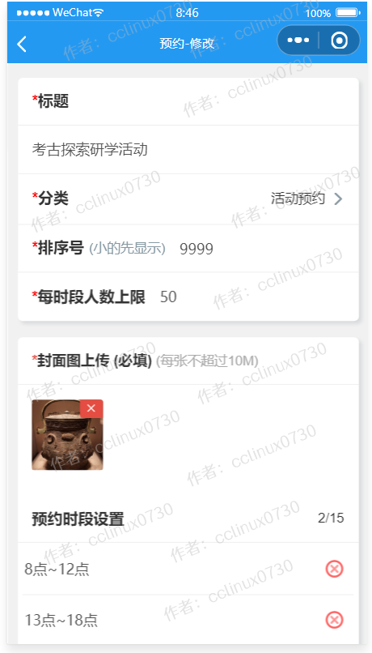

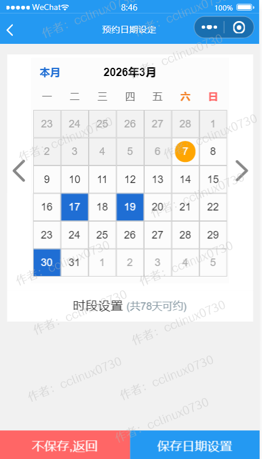

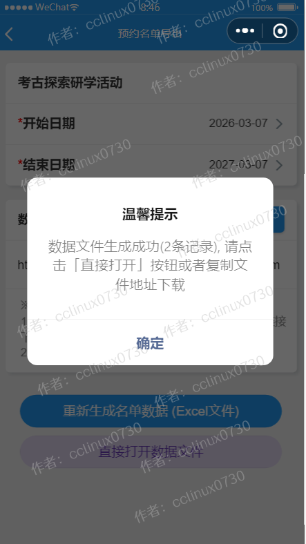

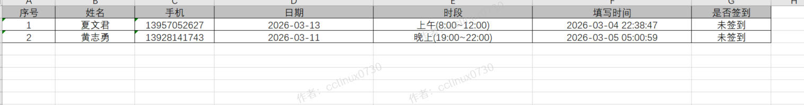