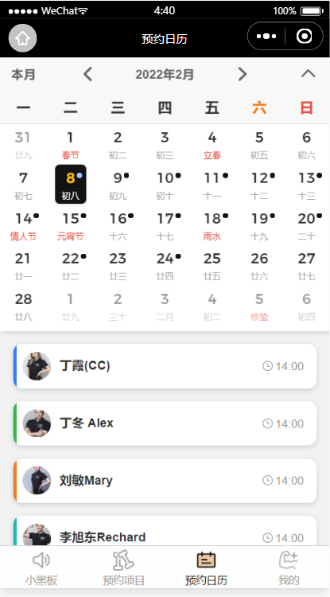

### 介绍
 以健身场馆预约为核心功能，提供线上健身课程预约的小程序平台
 
.png)

### 特点 
-   预约管理：开始/截止时间/人数/审核规则可灵活设置 
-  自定义客户预约填写的数据项
-  预约凭证：线下到场后校验/核销/二维码自助签到
-  详尽的数据：掌控全局/细致洞察/数据导出
-  及时到位的提醒：赴约提醒/手机日历提醒
-  仅需一台手机：便可发布及管理预约平台 

  

